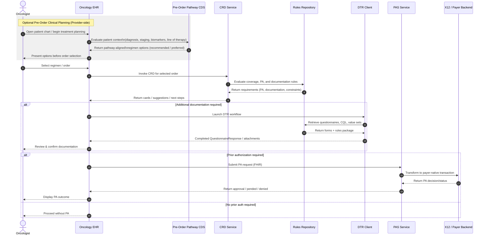
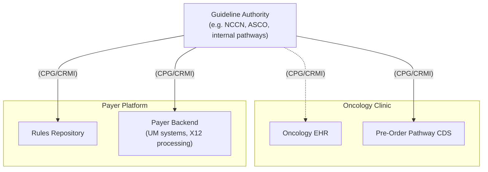

# Oncology Care Pathways and Authorization

This sequence depicts an **end-to-end oncology prior authorization workflow** that layers **pre-order clinical decision support** on top of the Da Vinci Burden Reduction framework, while aligning data exchange and clinical knowledge to open standards.

> This model extends Da Vinci by introducing **pre-order, guideline-driven CDS**, a **shared US Core + mCODE data foundation**, and **standardized computable guideline and regimen logic (FHIR Clinical Reasoning + CPG IG)** to align clinical decision-making with prior authorization.

The model introduces two key extensions:

1. An **optional pre-order, guideline-driven clinical planning layer**
2. A **shared data and knowledge foundation** based on **US Core + mCODE** and **FHIR Clinical Reasoning / CPG IG**

---

## Two-layer model

### 1) Pre-Order Clinical Planning (Provider-side, optional)

Before an order is placed, the clinician is supported by **pre-order pathway CDS** within the oncology EHR.

This step:

* evaluates patient-specific context: 
    * diagnosis and staging; biomarkers (e.g., ER/PR/HER2); line of therapy
* returns: 
    * recommended regimens; preferred vs acceptable options; clinically equivalent alternatives

This layer is:

* **Provider-driven**
* **Guideline-informed**
* Focused on selecting the *right treatment upfront*

---

### 2) Utilization Management (Da Vinci CRD → DTR → PAS)

Once a regimen is selected, the workflow transitions into the standard Da Vinci burden reduction sequence:

* **CRD** evaluates coverage, prior authorization, and documentation requirements
* **DTR** gathers structured documentation using questionnaires and rules
* **PAS** submits the authorization request and returns the decision

This layer is:

* **Payer-driven**
* **Policy-based**
* Focused on determining whether the selected treatment is *approved*

---

## Key addition: shaping intent before authorization

This optional **pre-order CDS prior to CRD**, shifts the workflow from:

* reactive authorization → **proactive alignment**

Instead of correcting decisions after the fact, the system:

* guides clinicians toward **guideline-aligned regimens**
* increases the likelihood of **first-pass approval**
* reduces downstream burden

---

## Key addition: shared clinical data layer (US Core + mCODE)

All data exchange across both layers is aligned to:

* **US Core** — foundational U.S. interoperability profiles
* **mCODE** — oncology-specific extensions for:
  * cancer diagnosis and staging
  * biomarkers
  * treatment regimens
  * outcomes

This ensures that the same structured data can:
* drive **pre-order CDS reasoning**
* satisfy **CRD rule evaluation**
* populate **DTR questionnaires**
* support **PAS submissions**

---

## Key addition: standard guideline interoperability (FHIR Clinical Reasoning + CPG IG)

This model explicitly standardizes how guidelines are represented and executed by leveraging:

* **FHIR Clinical Reasoning**
  * PlanDefinition
  * ActivityDefinition
  * Library (CQL)
* **HL7 CPG Implementation Guide (CPG-on-FHIR)**

This enables:

* **computable, shareable guidelines**
* traceability from:
  * narrative recommendations → structured logic → execution
* consistent use of:
  * value sets
  * expressions
  * decision logic

Across both layers, this allows:

* pre-order CDS and payer rules to be derived from **the same computable artifacts**
* reduced divergence between:
  * clinical guidance
  * utilization management logic

---

## Key addition: regimen-level standardization and comparison

A critical gap addressed by this model is the lack of standardization for **oncology regimen comparison at the anti-cancer protocol level**.

This model introduces:
* representation of **regimens as structured, computable entities**
* the ability to:
  * compare regimens for **clinical equivalency**
  * express **preference hierarchies** (e.g., preferred, acceptable alternatives)
  * distinguish:
    * anti-cancer therapy components
    * supportive medications

This enables:

* CDS to present **equivalent treatment options**
* payer systems to evaluate **policy against clinically comparable regimens**
* alignment between:
  * “clinically appropriate”
  * “payer-preferred”

---

## Resulting benefits

This combined approach enables:

* **Earlier alignment** between clinical decisions and payer expectations
* **Reduced administrative burden** (fewer DTR workflows, fewer resubmissions)
* **Higher approval rates** through better upfront selection
* **Consistency of logic** via shared computable guideline artifacts
* **Interoperability** across systems using US Core, mCODE, and Clinical Reasoning

---

## Sequence

---

## Guideline-based

An independent guideline authority can play a unique dual role in this model: serving both as a trusted source of **clinical decision support** and as a neutral **arbiter of baseline electronic prior authorization (ePA)**. By publishing evidence-based, computable guidance that defines clinically appropriate and equivalent treatment options, the authority can establish a common foundation that both providers and payers rely on. This creates the opportunity for a “baseline approval layer,” where treatments that adhere to guideline-defined criteria can be automatically recognized as appropriate for authorization, reducing variability across payers. In this way, the guideline authority helps bridge clinical intent and utilization management—supporting better upfront decisions while also enabling more consistent, transparent, and efficient prior authorization processes.

---

## Considerations

### mCODE gaps

mCODE provides a strong foundation for oncology interoperability, particularly for representing structured clinical facts such as diagnosis, staging, biomarkers, performance status, and treatment events. However, there are important gaps when applying mCODE to real-world prior authorization (PA) for anti-cancer treatments.

Most notably, mCODE does not yet represent **anti-cancer regimens or protocols as first-class, computable entities**, instead modeling individual medications and administrations. It also lacks standardized support for **line-of-therapy and sequencing concepts**, which are critical to oncology PA decisions. In addition, there is no consistent way to express **clinical equivalence or preference across regimens**, even though payer policies often rely on comparing multiple clinically acceptable options.

Beyond clinical representation, mCODE does not fully address **payer-facing requirements**, such as documentation rules, exception logic, or the structure of a complete PA submission. This gap is compounded by the fact that current federal ePA standards still only partially address drug-related prior authorization, even though many oncology workflows are driven by systemic therapies.

As a result, while mCODE captures the core oncology data needed for decision-making, it is **insufficient on its own to support end-to-end oncology prior authorization**. Additional standardization is needed around regimen modeling, sequencing, clinical equivalence, and integration with payer policy and authorization workflows.

### DaVinci gaps

Da Vinci significantly improves the mechanics of prior authorization, but remains:

* **reactive (post-order)**
* **service-level (not regimen-level)**
* **policy-driven (not guideline-aligned)**
* **transaction-focused (not knowledge-driven)**

> These limitations create an opportunity to extend Da Vinci with **pre-order CDS, regimen-level standardization, shared clinical data (US Core + mCODE), and computable guideline interoperability (FHIR Clinical Reasoning + CPG IG)** to better align oncology decision-making with prior authorization.

---

1. **Reactive (post-order) workflow**
   Starts after order selection, with no ability to guide regimen choice upfront—leading to rework and avoidable denials.
   
2. **No regimen-level model**
   Operates at service/medication level, while oncology decisions are made at the **protocol/regimen level**.
   
3. **No equivalence or preference semantics**
   Lacks standard ways to express:
   * clinically equivalent regimens
   * preferred vs acceptable options
   * step therapy within oncology care

4. **Disconnect between guidelines and payer policy**
   No shared, computable linkage between:

   * clinical guidance
   * authorization rules
     → drives misalignment and inconsistency

5. **Insufficient oncology data foundation**
   Relies on US Core alone, which does not fully support:
   * staging
   * biomarkers
   * treatment context
     → results in heavy DTR burden

6. **Documentation burden still persists (DTR)**
   Improves structure but still requires manual workflows and redundant data capture.

7. **Limited support for auto-approval (“silent success”)**
   No clear pattern for:
   * guideline-aligned care → no PA required
     → misses opportunity to eliminate friction entirely

8. **Incomplete support for drug-centric workflows**
   Oncology PA is heavily drug-driven, but standards and implementations remain uneven.

9. **No shared knowledge lifecycle**
   Lacks standardization for authoring, versioning, and distributing rules/guidelines → fragmentation across payers
