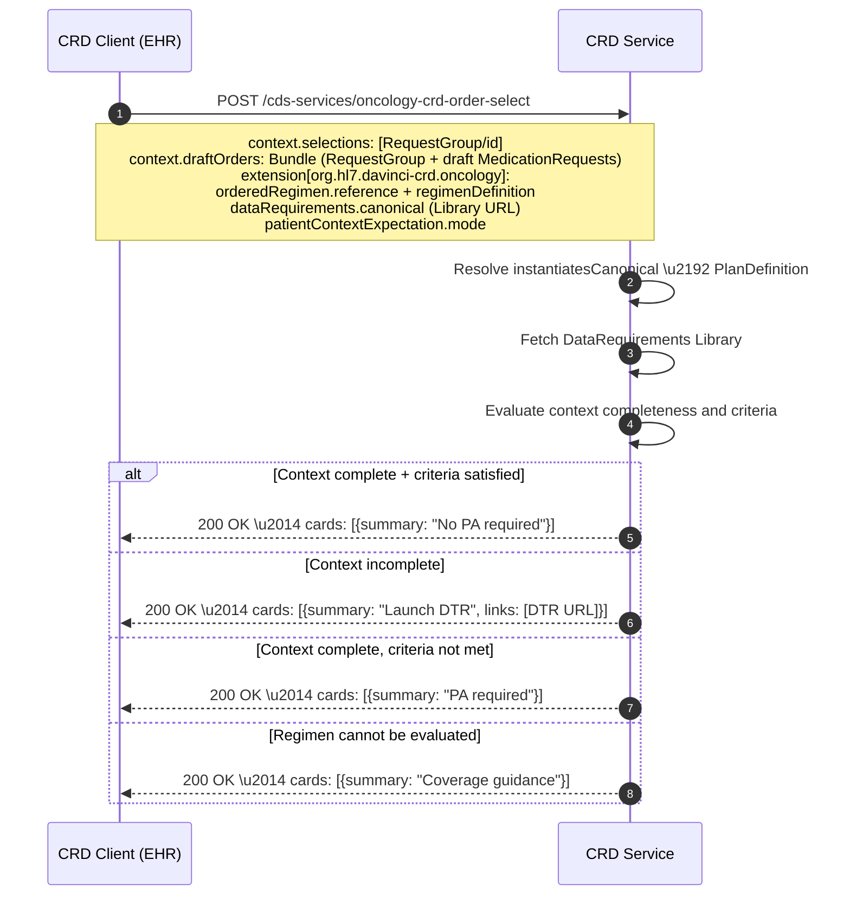

# CDS Hooks Oncology Extension

### Overview

This IG defines an oncology-specific extension for CDS Hooks `order-select` and `order-sign`
hooks, used within Da Vinci CRD. The extension carries the ordered regimen identity and the
cancer-specific data requirements needed for coverage evaluation.

### Conformance Intent

Base CDS Hooks and Da Vinci CRD are not modified. This IG defines a CRD oncology **profile**:
conditional requirements for systems claiming conformance to this IG.

> For CDS Clients claiming conformance to this oncology CRD profile, when an anti-cancer therapy
> regimen is selected or signed, the client **SHALL** include the oncology CRD extension in the
> CDS Hooks request.

> For CDS Services claiming conformance to this oncology CRD profile, the service **SHALL** be
> capable of interpreting the oncology CRD extension and the referenced anti-cancer regimen
> `RequestGroup` and its instantiated `PlanDefinition`.

### Extension Shape

The extension key is `org.hl7.davinci-crd.oncology`. It has three components:

| Component | Required | Purpose |
|---|---|---|
| `orderedRegimen` | SHALL | Identifies the `RequestGroup` instance and its canonical `PlanDefinition` |
| `dataRequirements` | SHALL | Identifies the cancer-specific data requirements (canonical or inline) |
| `patientContextExpectation` | SHOULD | Declares how patient context will be supplied |

```json
"extension": {
  "org.hl7.davinci-crd.oncology": {
    "orderedRegimen": {
      "reference": "RequestGroup/breast-cancer-regimen-001",
      "regimenDefinition": "http://hl7.org/fhir/us/codex-ocpa/PlanDefinition/paclitaxel-trastuzumab-regimen",
      "profile": "http://hl7.org/fhir/us/codex-ocpa/StructureDefinition/ocpa-anticancer-regimen-requestgroup"
    },
    "dataRequirements": {
      "purpose": "pre-approval",
      "canonical": "http://hl7.org/fhir/us/codex-ocpa/Library/breast-cancer-pa-data-requirements|1.0.0"
    },
    "patientContextExpectation": {
      "mode": "prefetch-or-fhir-access",
      "completeContextRequiredForPreApproval": true
    }
  }
}
```

### Inline Data Requirements Option

For pilots or simpler implementations, `dataRequirements` may include inline `DataRequirement`
entries rather than a canonical Library reference. See [Data Requirements Pattern](data-requirements.html).

### CDS Service Discovery

A CDS Service conforming to this IG SHOULD advertise its oncology capabilities in the discovery
response, including supported regimen profiles, supported data requirements Library profiles, and
supported cancer types.

### Possible CRD Outcomes

| Condition | CRD Response |
|---|---|
| Required context complete + criteria satisfied | No PA required, pre-approval, or silent success |
| Required context incomplete | Return DTR launch card |
| Required context complete but criteria not met | Return PA required or documentation required |
| Regimen cannot be evaluated | Return coverage/documentation guidance |



### Examples

See [Example: order-select request](Bundle-example-order-select-request.html) and
[Example: order-sign request](Bundle-example-order-sign-request.html).
