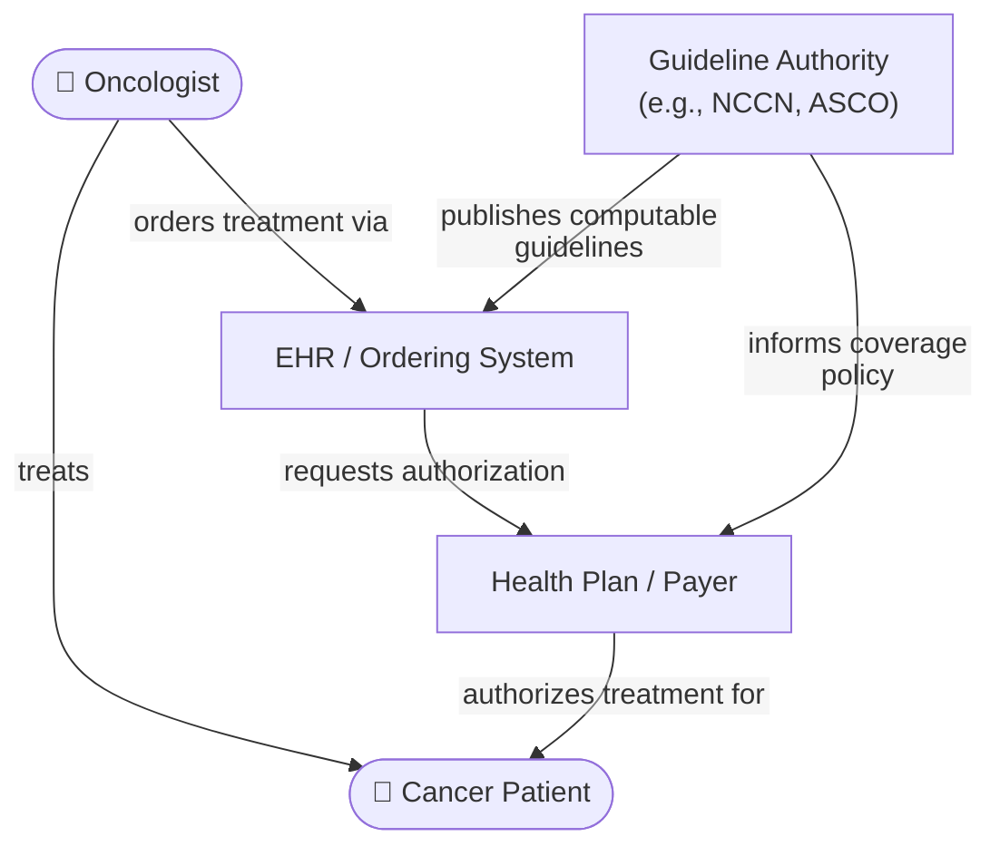

# OCPA Implementation Guide

This implementation guide defines a standards-based oncology prior authorization (OCPA)
framework that extends the [Da Vinci Burden Reduction](https://confluence.hl7.org/display/DVP)
suite — CRD, DTR, and PAS — with oncology-specific capabilities: a computable anti-cancer
regimen representation and a structured patient context package for authorization evaluation.

**Lead use case:** Breast cancer prior authorization

### The Problem

Getting cancer treatment approved takes too long. For patients with breast cancer and other
oncology diagnoses, prior authorization is fragmented, slow, and disconnected from the clinical
evidence that guided the treatment decision. There is no shared, standards-based language for
oncology treatment decisions and no common way to move the right clinical data from the point of
care to the authorization system at the right moment.

**The regulatory pressure is now direct.** CMS-0062-P (April 2026) extends prior authorization
requirements to prescription drugs — including chemotherapeutics and anti-cancer agents.

### The Framework

This IG addresses two connected layers:

1. **Optional pre-order CDS** — guideline-aligned regimen recommendations surfaced in the EHR
   before an order is placed, increasing the likelihood that the treatment ordered meets coverage
   criteria.

2. **Structured authorization exchange** — a CDS Hooks extension for oncology CRD that carries the
   ordered regimen and required patient context (diagnosis, staging, biomarkers, line of therapy)
   to the coverage decision service as structured, computable data.

### Scope

**In scope:**
- Anti-cancer regimen representation as a first-class FHIR artifact
- CDS Hooks extension for oncology `order-select` and `order-sign`
- Patient context data requirements for oncology PA evaluation
- Breast cancer PA as the lead use case

**Out of scope (this version):**
- Regimen clinical equivalence and preference ranking
- Multi-cancer generalizations beyond the breast cancer use case
- X12 transaction details (covered by Da Vinci PAS)

### Stakeholders

| Stakeholder | Benefit |
|---|---|
| **Oncology Practice / Clinician** | Fewer authorization delays; reduced administrative workload |
| **Cancer Patient** | Faster access to guideline-appropriate treatment |
| **Health Plan / Payer** | Structured, computable authorization requests; fewer manual reviews |
| **EHR / Ordering System** | Reusable, standards-based integration pattern for oncology workflows |
| **Guideline Authority** | Computable guidelines (e.g., NCCN, ASCO) that align clinical and payer logic |

### Dependencies

| Implementation Guide | Version | Role |
|---|---|---|
| [US Core](http://hl7.org/fhir/us/core) | 7.0.0 | Base US patient, practitioner, and clinical data profiles |
| [mCODE](http://hl7.org/fhir/us/mcode) | 4.0.0 | Oncology clinical data foundation |
| [Da Vinci CRD](http://hl7.org/fhir/us/davinci-crd) | 2.1.0 | Coverage Requirements Discovery workflow backbone |
| [Da Vinci DTR](http://hl7.org/fhir/us/davinci-dtr) | 2.0.0 | Documentation Templates and Rules |
| [Da Vinci PAS](http://hl7.org/fhir/us/davinci-pas) | 2.2.1 | Prior Authorization Support |

### How to Read This Guide

- [Background](background.html) — Clinical problem, regulatory context, and gaps in existing standards
- [Use Cases and Actors](use-cases.html) — The two-layer workflow, system actors, and actor responsibilities
- **Specification:**
  - [Regimen Modeling](regimen-model.html) — How anti-cancer regimens are represented as FHIR `PlanDefinition` and `RequestGroup`
  - [CDS Hooks Oncology Extension](cds-hooks-extension.html) — The CDS Hooks extension for oncology CRD
  - [Data Requirements Pattern](data-requirements.html) — The `Library`-based patient context package for CRD and DTR
  - [Breast Cancer PA](breast-cancer-pa.html) — Breast cancer-specific data requirements and gap analysis
- [Conformance](conformance.html) — Requirements for claiming conformance to this IG
- [Artifacts](artifacts.html) — All profiles, extensions, value sets, and examples
