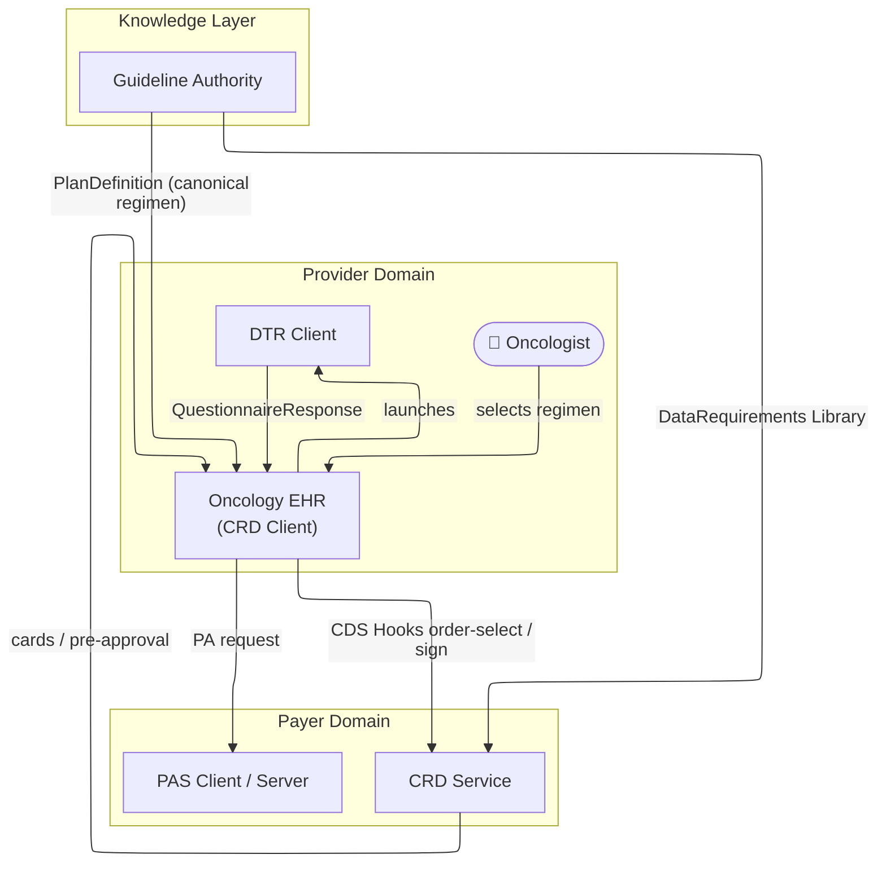
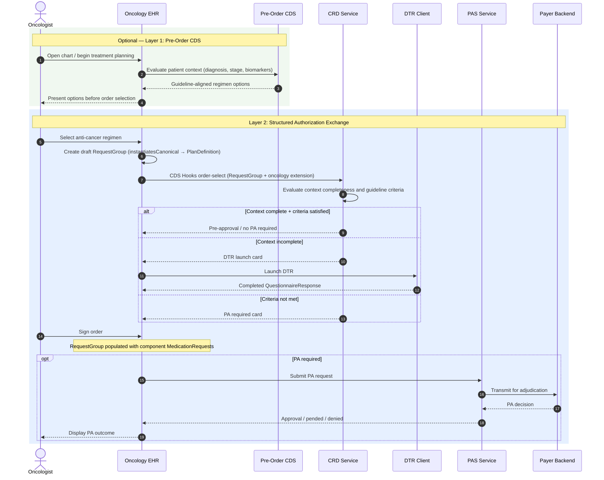

# Use Cases and Actors

### Actors

| Actor | Description |
|---|---|
| **Oncology CRD Client** | An EHR or ordering system that invokes CDS Hooks `order-select` or `order-sign` during anti-cancer regimen ordering |
| **Oncology CRD Service** | A coverage decision service that evaluates the ordered regimen and required patient context, returning cards or pre-approval status |
| **DTR Client** | A system that collects missing patient context using questionnaires driven by the data requirements Library |
| **PAS Client** | A system that submits a structured prior authorization request when PA is required after CRD/DTR |
| **PAS Server** | A payer system that receives and adjudicates the PA request |
| **Guideline Authority** | An organization (e.g., NCCN, ASCO, internal pathways program) that publishes canonical regimen definitions as computable `PlanDefinition` artifacts |



### The Two-Layer Framework

This IG defines two connected layers that together address the full oncology PA workflow.

#### Layer 1 — Pre-Order Clinical Decision Support (optional)

Before a clinician places an order, the EHR surfaces guideline-aligned regimen recommendations
based on the patient's specific situation: diagnosis, stage, biomarkers, and line of therapy.

This layer:
- Evaluates patient-specific context against computable clinical guidelines
- Returns recommended regimens with preferred vs. acceptable options
- Increases the probability that the treatment ordered meets payer criteria *before* the order
  is placed

This layer is **provider-driven**, **guideline-informed**, and focuses on selecting the right
treatment upfront.

#### Layer 2 — Structured Authorization Exchange (Da Vinci CRD → DTR → PAS)

Once a regimen is selected, the workflow uses the Da Vinci CRD/DTR/PAS sequence with
oncology-specific extensions:

- **CRD** evaluates the ordered `RequestGroup` regimen instance, using the cancer-specific data
  requirements Library to determine whether pre-approval can be granted
- **DTR** uses the same data requirements to collect or prepopulate missing patient context
- **PAS** submits the structured authorization package when PA is still required

### Workflow: Complete Oncology PA Sequence

```
1. Clinician opens patient chart and begins treatment planning

2. [Optional] Pre-order CDS evaluates patient context and returns
   guideline-aligned regimen options before order selection

3. Clinician selects anti-cancer regimen → EHR creates draft RequestGroup
   (RequestGroup.instantiatesCanonical → PlanDefinition regimen definition)

4. EHR invokes CDS Hooks order-select with oncology extension:
   - Selected RequestGroup in context.selections and draftOrders
   - Oncology extension identifying regimen and data requirements Library

5. CRD Service evaluates:
   - Is required patient context complete?
   - Does the regimen meet guideline / policy criteria?

   IF complete + criteria satisfied → pre-approval or no PA required
   IF context incomplete → return DTR launch card
   IF complete but criteria not met → return PA required card

6. DTR (if launched) uses data requirements Library to:
   - Select or generate questionnaire
   - Prepopulate known patient data
   - Collect missing documentation

7. At order-sign, EHR includes instantiated component MedicationRequest resources
   in the RequestGroup actions

8. PAS (if PA required) submits structured authorization package
   Payer adjudicates and returns decision
```



### Pre-Conditions

For the full workflow to operate:
- The EHR SHALL have access to relevant patient context (mCODE-based Observations, Conditions,
  MedicationRequests)
- A canonical regimen definition (`OncologyAntiCancerRegimenPlanDefinition`) SHOULD be available
  for the ordered regimen
- The CRD Service SHALL have access to a cancer-specific data requirements Library
  (e.g., `BreastCancerPADataRequirementsLibrary`)

### Relationship to Da Vinci

This IG extends Da Vinci CRD/DTR/PAS. It does not replace any Da Vinci workflow. Systems
implementing this IG SHALL also conform to the relevant Da Vinci IGs for the workflows they
support.
